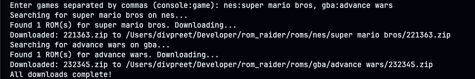

 # ROM Raider

A python personal project i needed for my emulation setup, works on [edgeemu.net](https://edgeemu.net)
-- --

-- --

### Why i built this
Recently i just setup retroarch + es-de on my hackintosh to play retro games, and i didnt want to go through the process of donwloading ROM's one by one, so i just mass download them all at once.

-- -- 

## Usage

### Supported Consoles
- GBA
- SNES
- NES
- PS1
- NDS
- N64
+ all the console over [here](https://edgeemu.net)

### Install Dependencies

It's pretty simple, just clone the repo, then run:

```bash
pip install -r requirements.txt
```

After that just run **main.py**, and just enter the console the game in this format:

```bash
nes:super mario bros, gba:advance wars
```
Your games will download in a .zip format and will be automatically sorted:
```
roms/
├── gba/
│   ├── advance wars.zip
└── snes/
    ├── super mario world.smc
```
### Future Plans
I really want to make this into a macOS utility or someting in the future!

## Open Source
contributions are welcome! feel free to open issues or submit pull requests.

## License
**MIT**

**Disclaimer:** This tool is intended for archival and preservation purposes only. I do not condone piracy or the unauthorized downloading of copyrighted material. Please only download ROMs for games you own.
